# Modelos del Sistema de Presupuesto - SIDAPRESS

## Índice de Apps

1. [Authentication](#1-authentication---autenticación-y-permisos)
2. [Organizacion](#2-organizacion---estructura-organizacional)
3. [Catalogos](#3-catalogos---catálogos-del-sistema)
4. [Presupuesto](#4-presupuesto---gestión-presupuestal)
5. [Importacion](#5-importacion---importación-de-datos)
6. [Alertas](#6-alertas---sistema-de-alertas)
7. [Auditoria](#7-auditoria---auditoría-y-sesiones)
8. [Diagrama de Clases](#diagrama-de-clases-mermaid)

---

## 1. Authentication - Autenticación y Permisos

### Usuario (extiende `AbstractUser`)

| Campo | Tipo | Restricciones |
|-------|------|---------------|
| `dni` | CharField(8) | unique, nullable |
| `telefono` | CharField(15) | blank |
| `cargo` | CharField(100) | blank |
| `is_active` | BooleanField | default=True |
| `creado_por` | FK → Usuario (self) | SET_NULL, nullable |
| `fecha_creacion` | DateTimeField | auto_now_add |
| `fecha_actualizacion` | DateTimeField | auto_now |

- **Tabla:** `usuario`
- **Ordenamiento:** `['username']`

### Rol

| Campo | Tipo | Restricciones |
|-------|------|---------------|
| `nombre` | CharField(100) | |
| `codigo` | CharField(50) | unique |
| `descripcion` | TextField | blank |
| `nivel_jerarquico` | IntegerField | choices: 0=Superadmin, 1=Alcalde/Alta Dirección, 2=Gerente, 3=Jefe de Oficina, 4=Analista Presupuesto, 5=Usuario Básico |
| `es_sistema` | BooleanField | default=False |
| `is_active` | BooleanField | default=True |
| `fecha_creacion` | DateTimeField | auto_now_add |

- **Tabla:** `rol`
- **Ordenamiento:** `['nivel_jerarquico']`

### Permiso

| Campo | Tipo | Restricciones |
|-------|------|---------------|
| `nombre` | CharField(100) | |
| `codigo` | CharField(100) | unique |
| `recurso` | CharField(50) | |
| `accion` | CharField | choices: view, create, edit, delete, export, import, manage |
| `descripcion` | TextField | blank |

- **Tabla:** `permiso`
- **Ordenamiento:** `['recurso', 'accion']`
- **unique_together:** `['recurso', 'accion']`

### RolPermiso (tabla intermedia)

| Campo | Tipo | Restricciones |
|-------|------|---------------|
| `rol` | FK → Rol | CASCADE |
| `permiso` | FK → Permiso | CASCADE |

- **Tabla:** `rol_permiso`
- **unique_together:** `['rol', 'permiso']`

### UsuarioRol (tabla intermedia)

| Campo | Tipo | Restricciones |
|-------|------|---------------|
| `usuario` | FK → Usuario | CASCADE |
| `rol` | FK → Rol | CASCADE |
| `unidad_organica` | FK → UnidadOrganica | SET_NULL, nullable |
| `incluir_hijos` | BooleanField | default=False |
| `fecha_asignacion` | DateTimeField | auto_now_add |
| `asignado_por` | FK → Usuario | SET_NULL, nullable |

- **Tabla:** `usuario_rol`
- **unique_together:** `['usuario', 'rol', 'unidad_organica']`

---

## 2. Organizacion - Estructura Organizacional

### UnidadOrganica

| Campo | Tipo | Restricciones |
|-------|------|---------------|
| `codigo` | CharField(20) | unique |
| `nombre` | CharField(200) | |
| `nombre_corto` | CharField(50) | blank |
| `nivel` | IntegerField | choices: 1=Órgano, 2=Unidad Orgánica, 3=Sub Unidad Orgánica |
| `parent` | FK → UnidadOrganica (self) | CASCADE, nullable (jerárquico) |
| `responsable` | FK → Usuario | SET_NULL, nullable |
| `is_active` | BooleanField | default=True |
| `fecha_creacion` | DateTimeField | auto_now_add |
| `fecha_actualizacion` | DateTimeField | auto_now |

- **Tabla:** `unidad_organica`
- **Ordenamiento:** `['codigo']`
- **Métodos:** `get_hijos_recursivo()` — retorna todas las unidades hijas activas recursivamente

---

## 3. Catalogos - Catálogos del Sistema

### AnioFiscal

| Campo | Tipo | Restricciones |
|-------|------|---------------|
| `anio` | IntegerField | unique |
| `is_active` | BooleanField | default=True |
| `is_cerrado` | BooleanField | default=False |
| `fecha_creacion` | DateTimeField | auto_now_add |

- **Tabla:** `anio_fiscal`
- **Ordenamiento:** `['-anio']`

### FuenteFinanciamiento

| Campo | Tipo | Restricciones |
|-------|------|---------------|
| `codigo` | CharField(10) | unique |
| `nombre` | CharField(200) | |
| `nombre_corto` | CharField(50) | blank |
| `is_active` | BooleanField | default=True |

- **Tabla:** `fuente_financiamiento`
- **Ordenamiento:** `['codigo']`

### Rubro

| Campo | Tipo | Restricciones |
|-------|------|---------------|
| `codigo` | CharField(10) | unique |
| `nombre` | CharField(200) | |
| `nombre_corto` | CharField(50) | blank |
| `descripcion` | TextField | blank |
| `fuente` | FK → FuenteFinanciamiento | CASCADE |
| `is_active` | BooleanField | default=True |

- **Tabla:** `rubro`
- **Ordenamiento:** `['codigo']`

### ClasificadorGasto

| Campo | Tipo | Restricciones |
|-------|------|---------------|
| `codigo` | CharField(20) | unique |
| `nombre` | CharField(300) | |
| `tipo_transaccion` | CharField(100) | blank |
| `generica` | CharField(100) | blank |
| `subgenerica` | CharField(100) | blank |
| `subgenerica_det` | CharField(100) | blank |
| `especifica` | CharField(100) | blank |
| `especifica_det` | CharField(100) | blank |
| `nombre_tipo_transaccion` | CharField(100) | blank |
| `nombre_generica` | CharField(200) | blank |
| `nombre_subgenerica` | CharField(200) | blank |
| `nombre_subgenerica_det` | CharField(200) | blank |
| `nombre_especifica` | CharField(200) | blank |
| `nombre_especifica_det` | CharField(300) | blank |
| `descripcion_detallada` | TextField | blank |
| `is_active` | BooleanField | default=True |

- **Tabla:** `clasificador_gasto`
- **Ordenamiento:** `['codigo']`

---

## 4. Presupuesto - Gestión Presupuestal

### Meta

| Campo | Tipo | Restricciones |
|-------|------|---------------|
| `anio_fiscal` | FK → AnioFiscal | CASCADE |
| `unidad_organica` | FK → UnidadOrganica | SET_NULL, nullable |
| `codigo` | CharField(20) | |
| `nombre` | CharField(500) | |
| `finalidad` | TextField | blank, default='' |
| `tipo_meta` | CharField | choices: PRODUCTO, PROYECTO; default=PROYECTO |
| `cantidad_meta_anual` | DecimalField(15,2) | default=0 |
| `sec_func` | IntegerField | nullable |
| `codigo_programa_pptal` | CharField(20) | blank |
| `codigo_producto_proyecto` | CharField(20) | blank |
| `codigo_actividad` | CharField(20) | blank |
| `codigo_funcion` | CharField(10) | blank |
| `codigo_division_fn` | CharField(10) | blank |
| `codigo_grupo_fn` | CharField(10) | blank |
| `codigo_finalidad` | CharField(20) | blank |
| `nombre_programa_pptal` | CharField(300) | blank |
| `nombre_producto_proyecto` | CharField(500) | blank |
| `nombre_actividad` | CharField(500) | blank |
| `tipo_producto_proyecto` | CharField(50) | blank |
| `tipo_actividad` | CharField(50) | blank |
| `codigo_unidad_medida` | CharField(10) | blank |
| `nombre_unidad_medida` | CharField(100) | blank |
| `is_active` | BooleanField | default=True |
| `fecha_creacion` | DateTimeField | auto_now_add |
| `fecha_actualizacion` | DateTimeField | auto_now |

- **Tabla:** `meta`
- **Ordenamiento:** `['codigo']`
- **unique_together:** `['anio_fiscal', 'codigo']`

### EjecucionPresupuestal

| Campo | Tipo | Restricciones |
|-------|------|---------------|
| `anio_fiscal` | FK → AnioFiscal | CASCADE |
| `meta` | FK → Meta | CASCADE |
| `rubro` | FK → Rubro | CASCADE |
| `clasificador_gasto` | FK → ClasificadorGasto | CASCADE |
| `codigo_categoria_gasto` | CharField(10) | blank |
| `nombre_categoria_gasto` | CharField(100) | blank |
| `restringido` | BooleanField | default=False |
| `pia` | DecimalField(15,2) | default=0 |
| `modificaciones` | DecimalField(15,2) | default=0 |
| `pim` | DecimalField(15,2) | default=0 |
| `certificado` | DecimalField(15,2) | default=0 |
| `compromiso_anual` | DecimalField(15,2) | default=0 |
| `archivo_origen` | FK → ImportacionArchivo | SET_NULL, nullable |
| `importado_por` | FK → Usuario | SET_NULL, nullable |
| `fecha_creacion` | DateTimeField | auto_now_add |
| `fecha_actualizacion` | DateTimeField | auto_now |

- **Tabla:** `ejecucion_presupuestal`
- **Índices:** `[('anio_fiscal', 'meta'), ('anio_fiscal', 'rubro')]`

### EjecucionMensual

| Campo | Tipo | Restricciones |
|-------|------|---------------|
| `ejecucion` | FK → EjecucionPresupuestal | CASCADE |
| `mes` | IntegerField | 1-12 |
| `compromiso` | DecimalField(15,2) | default=0 |
| `devengado` | DecimalField(15,2) | default=0 |
| `girado` | DecimalField(15,2) | default=0 |
| `pagado` | DecimalField(15,2) | default=0 |
| `fecha_actualizacion` | DateTimeField | auto_now |

- **Tabla:** `ejecucion_mensual`
- **Ordenamiento:** `['ejecucion', 'mes']`
- **unique_together:** `['ejecucion', 'mes']`

### ModificacionPresupuestal

| Campo | Tipo | Restricciones |
|-------|------|---------------|
| `ejecucion` | FK → EjecucionPresupuestal | CASCADE |
| `tipo` | CharField | choices: CREDITO, TRANSFERENCIA, HABILITACION, ANULACION |
| `monto` | DecimalField(15,2) | |
| `documento_referencia` | CharField(100) | blank |
| `descripcion` | TextField | blank |
| `fecha_modificacion` | DateField | |
| `registrado_por` | FK → Usuario | SET_NULL, nullable |
| `fecha_creacion` | DateTimeField | auto_now_add |

- **Tabla:** `modificacion_presupuestal`
- **Ordenamiento:** `['-fecha_modificacion']`

### AvanceFisico

| Campo | Tipo | Restricciones |
|-------|------|---------------|
| `meta` | OneToOneField → Meta | CASCADE |
| `cantidad_meta_semestral` | DecimalField(15,2) | default=0 |
| `avance_fisico_anual` | DecimalField(15,2) | default=0 |
| `avance_fisico_semestral` | DecimalField(15,2) | default=0 |
| `observaciones` | TextField | blank |
| `registrado_por` | FK → Usuario | SET_NULL, nullable |
| `fecha_creacion` | DateTimeField | auto_now_add |
| `fecha_actualizacion` | DateTimeField | auto_now |

- **Tabla:** `avance_fisico`

---

## 5. Importacion - Importación de Datos

### ImportacionArchivo

| Campo | Tipo | Restricciones |
|-------|------|---------------|
| `archivo` | FileField | upload_to='uploads/excel/' |
| `nombre_archivo` | CharField(255) | |
| `hash_archivo` | CharField(64) | |
| `tamanio` | IntegerField | default=0 |
| `anio_fiscal` | FK → AnioFiscal | CASCADE |
| `estado` | CharField | choices: PENDIENTE, PROCESANDO, COMPLETADO, ERROR, PARCIAL; default=PENDIENTE |
| `total_filas` | IntegerField | default=0 |
| `filas_procesadas` | IntegerField | default=0 |
| `filas_con_error` | IntegerField | default=0 |
| `filas_creadas` | IntegerField | default=0 |
| `filas_actualizadas` | IntegerField | default=0 |
| `filas_sin_cambios` | IntegerField | default=0 |
| `log_errores` | JSONField | default=list |
| `estadisticas_detalle` | JSONField | default=dict |
| `importado_por` | FK → Usuario | SET_NULL, nullable |
| `fecha_inicio` | DateTimeField | auto_now_add |
| `fecha_fin` | DateTimeField | nullable |

- **Tabla:** `importacion_archivo`
- **Ordenamiento:** `['-fecha_inicio']`

---

## 6. Alertas - Sistema de Alertas

### Alerta

| Campo | Tipo | Restricciones |
|-------|------|---------------|
| `tipo_alerta` | CharField | choices: SUBEJECUCION, SOBRECERTIFICACION, META_ATRASADA, MODIFICACION, VENCIMIENTO |
| `nivel_severidad` | CharField | choices: INFO, WARNING, CRITICAL; default=INFO |
| `titulo` | CharField(200) | |
| `mensaje` | TextField | |
| `datos_contexto` | JSONField | default=dict |
| `estado` | CharField | choices: ACTIVA, LEIDA, RESUELTA; default=ACTIVA |
| `anio_fiscal` | FK → AnioFiscal | CASCADE, nullable |
| `fecha_creacion` | DateTimeField | auto_now_add |
| `fecha_resolucion` | DateTimeField | nullable |

- **Tabla:** `alerta`
- **Ordenamiento:** `['-fecha_creacion']`

### NotificacionUsuario

| Campo | Tipo | Restricciones |
|-------|------|---------------|
| `usuario` | FK → Usuario | CASCADE |
| `alerta` | FK → Alerta | CASCADE |
| `is_leida` | BooleanField | default=False |
| `fecha_lectura` | DateTimeField | nullable |
| `fecha_creacion` | DateTimeField | auto_now_add |

- **Tabla:** `notificacion_usuario`
- **Ordenamiento:** `['-fecha_creacion']`
- **unique_together:** `['usuario', 'alerta']`

---

## 7. Auditoria - Auditoría y Sesiones

### LogAuditoria

| Campo | Tipo | Restricciones |
|-------|------|---------------|
| `usuario` | FK → Usuario | SET_NULL, nullable |
| `accion` | CharField | choices: CREATE, UPDATE, DELETE, LOGIN, LOGOUT, IMPORT, EXPORT |
| `tabla` | CharField(100) | blank |
| `registro_id` | CharField(50) | blank |
| `datos_anteriores` | JSONField | nullable |
| `datos_nuevos` | JSONField | nullable |
| `ip_address` | GenericIPAddressField | nullable |
| `user_agent` | TextField | blank |
| `fecha_hora` | DateTimeField | auto_now_add |

- **Tabla:** `log_auditoria`
- **Ordenamiento:** `['-fecha_hora']`
- **Índices:** `[('-fecha_hora', 'usuario'), ('tabla', 'accion')]`

### SesionUsuario

| Campo | Tipo | Restricciones |
|-------|------|---------------|
| `usuario` | FK → Usuario | CASCADE |
| `token_jti` | CharField(255) | unique |
| `ip_address` | GenericIPAddressField | nullable |
| `user_agent` | TextField | blank |
| `fecha_inicio` | DateTimeField | auto_now_add |
| `fecha_fin` | DateTimeField | nullable |
| `is_active` | BooleanField | default=True |

- **Tabla:** `sesion_usuario`
- **Ordenamiento:** `['-fecha_inicio']`

---

## Diagrama de Clases (Mermaid)

```mermaid
classDiagram
    direction TB

    %% ==================== AUTHENTICATION ====================
    class Usuario {
        +String dni
        +String telefono
        +String cargo
        +Boolean is_active
        +DateTime fecha_creacion
        +DateTime fecha_actualizacion
        +__str__() String
    }

    class Rol {
        +String nombre
        +String codigo
        +String descripcion
        +Integer nivel_jerarquico
        +Boolean es_sistema
        +Boolean is_active
        +DateTime fecha_creacion
    }

    class Permiso {
        +String nombre
        +String codigo
        +String recurso
        +String accion
        +String descripcion
    }

    class RolPermiso {
        <<Junction Table>>
    }

    class UsuarioRol {
        <<Junction Table>>
        +Boolean incluir_hijos
        +DateTime fecha_asignacion
    }

    %% ==================== ORGANIZACION ====================
    class UnidadOrganica {
        +String codigo
        +String nombre
        +String nombre_corto
        +Integer nivel
        +Boolean is_active
        +DateTime fecha_creacion
        +DateTime fecha_actualizacion
        +get_hijos_recursivo() List
    }

    %% ==================== CATALOGOS ====================
    class AnioFiscal {
        +Integer anio
        +Boolean is_active
        +Boolean is_cerrado
        +DateTime fecha_creacion
    }

    class FuenteFinanciamiento {
        +String codigo
        +String nombre
        +String nombre_corto
        +Boolean is_active
    }

    class Rubro {
        +String codigo
        +String nombre
        +String nombre_corto
        +String descripcion
        +Boolean is_active
    }

    class ClasificadorGasto {
        +String codigo
        +String nombre
        +String tipo_transaccion
        +String generica
        +String subgenerica
        +String subgenerica_det
        +String especifica
        +String especifica_det
        +Boolean is_active
    }

    %% ==================== PRESUPUESTO ====================
    class Meta {
        +String codigo
        +String nombre
        +String finalidad
        +String tipo_meta
        +Decimal cantidad_meta_anual
        +Integer sec_func
        +String codigo_programa_pptal
        +String codigo_producto_proyecto
        +String codigo_actividad
        +String codigo_funcion
        +String nombre_programa_pptal
        +String nombre_producto_proyecto
        +String nombre_actividad
        +Boolean is_active
        +DateTime fecha_creacion
        +DateTime fecha_actualizacion
    }

    class EjecucionPresupuestal {
        +String codigo_categoria_gasto
        +String nombre_categoria_gasto
        +Boolean restringido
        +Decimal pia
        +Decimal modificaciones
        +Decimal pim
        +Decimal certificado
        +Decimal compromiso_anual
        +DateTime fecha_creacion
        +DateTime fecha_actualizacion
    }

    class EjecucionMensual {
        +Integer mes
        +Decimal compromiso
        +Decimal devengado
        +Decimal girado
        +Decimal pagado
        +DateTime fecha_actualizacion
    }

    class ModificacionPresupuestal {
        +String tipo
        +Decimal monto
        +String documento_referencia
        +String descripcion
        +Date fecha_modificacion
        +DateTime fecha_creacion
    }

    class AvanceFisico {
        +Decimal cantidad_meta_semestral
        +Decimal avance_fisico_anual
        +Decimal avance_fisico_semestral
        +String observaciones
        +DateTime fecha_creacion
        +DateTime fecha_actualizacion
    }

    %% ==================== IMPORTACION ====================
    class ImportacionArchivo {
        +File archivo
        +String nombre_archivo
        +String hash_archivo
        +Integer tamanio
        +String estado
        +Integer total_filas
        +Integer filas_procesadas
        +Integer filas_con_error
        +Integer filas_creadas
        +Integer filas_actualizadas
        +Integer filas_sin_cambios
        +JSON log_errores
        +JSON estadisticas_detalle
        +DateTime fecha_inicio
        +DateTime fecha_fin
    }

    %% ==================== ALERTAS ====================
    class Alerta {
        +String tipo_alerta
        +String nivel_severidad
        +String titulo
        +String mensaje
        +JSON datos_contexto
        +String estado
        +DateTime fecha_creacion
        +DateTime fecha_resolucion
    }

    class NotificacionUsuario {
        +Boolean is_leida
        +DateTime fecha_lectura
        +DateTime fecha_creacion
    }

    %% ==================== AUDITORIA ====================
    class LogAuditoria {
        +String accion
        +String tabla
        +String registro_id
        +JSON datos_anteriores
        +JSON datos_nuevos
        +String ip_address
        +String user_agent
        +DateTime fecha_hora
    }

    class SesionUsuario {
        +String token_jti
        +String ip_address
        +String user_agent
        +DateTime fecha_inicio
        +DateTime fecha_fin
        +Boolean is_active
    }

    %% ==================== RELACIONES ====================

    %% Authentication
    Usuario "1" --> "0..1" Usuario : creado_por
    UsuarioRol "*" --> "1" Usuario : usuario
    UsuarioRol "*" --> "1" Rol : rol
    UsuarioRol "*" --> "0..1" UnidadOrganica : unidad_organica
    UsuarioRol "*" --> "0..1" Usuario : asignado_por
    RolPermiso "*" --> "1" Rol : rol
    RolPermiso "*" --> "1" Permiso : permiso

    %% Organizacion
    UnidadOrganica "0..*" --> "0..1" UnidadOrganica : parent
    UnidadOrganica "*" --> "0..1" Usuario : responsable

    %% Catalogos
    Rubro "*" --> "1" FuenteFinanciamiento : fuente

    %% Presupuesto
    Meta "*" --> "1" AnioFiscal : anio_fiscal
    Meta "*" --> "0..1" UnidadOrganica : unidad_organica
    EjecucionPresupuestal "*" --> "1" AnioFiscal : anio_fiscal
    EjecucionPresupuestal "*" --> "1" Meta : meta
    EjecucionPresupuestal "*" --> "1" Rubro : rubro
    EjecucionPresupuestal "*" --> "1" ClasificadorGasto : clasificador_gasto
    EjecucionPresupuestal "*" --> "0..1" ImportacionArchivo : archivo_origen
    EjecucionPresupuestal "*" --> "0..1" Usuario : importado_por
    EjecucionMensual "*" --> "1" EjecucionPresupuestal : ejecucion
    ModificacionPresupuestal "*" --> "1" EjecucionPresupuestal : ejecucion
    ModificacionPresupuestal "*" --> "0..1" Usuario : registrado_por
    AvanceFisico "0..1" --> "1" Meta : meta

    %% Importacion
    ImportacionArchivo "*" --> "1" AnioFiscal : anio_fiscal
    ImportacionArchivo "*" --> "0..1" Usuario : importado_por

    %% Alertas
    Alerta "*" --> "0..1" AnioFiscal : anio_fiscal
    NotificacionUsuario "*" --> "1" Usuario : usuario
    NotificacionUsuario "*" --> "1" Alerta : alerta

    %% Auditoria
    LogAuditoria "*" --> "0..1" Usuario : usuario
    SesionUsuario "*" --> "1" Usuario : usuario
```

