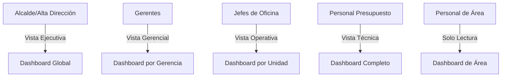
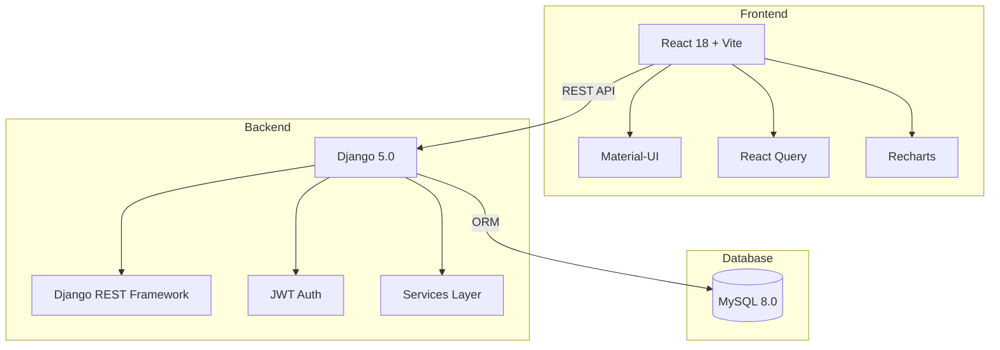
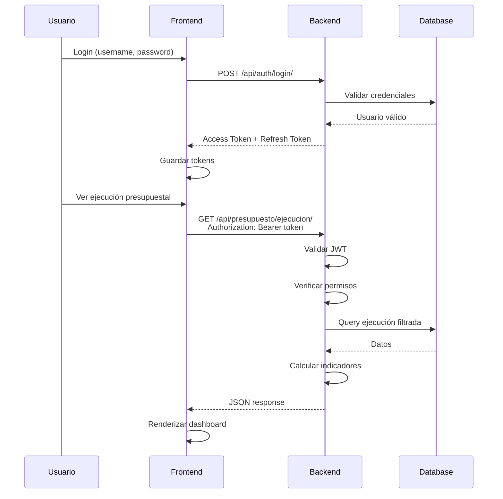
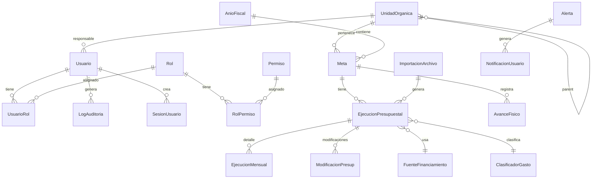
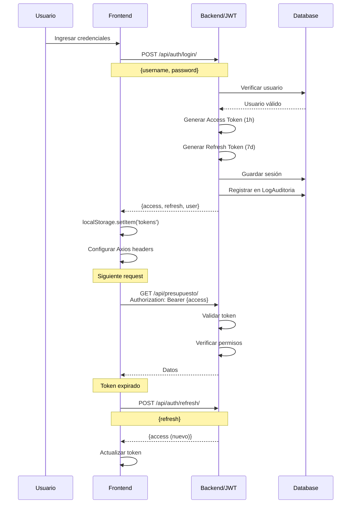
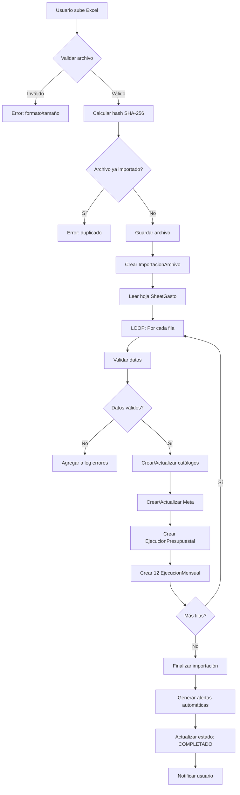

# 📘 MANUAL DE DESARROLLO - SIDAPRESS
## Sistema de Dashboards Presupuestales Municipales

**Stack**: Django 5.0 + React 18 + Vite 5 + MySQL 8.0  
**Versión**: 1.0.0  
**Fecha**: Febrero 2026

---

## 📑 ÍNDICE

1. [Visión General del Sistema](#1-visión-general)
2. [Arquitectura](#2-arquitectura)
3. [Base de Datos](#3-base-de-datos)
4. [Estructura del Proyecto](#4-estructura-del-proyecto)
5. [Sistema de Autenticación](#5-autenticación)
6. [Flujos Principales](#6-flujos-principales)
7. [Plan de Desarrollo](#7-plan-de-desarrollo)
8. [Configuración Inicial](#8-configuración-inicial)

---

## 1. VISIÓN GENERAL

### 1.1 Objetivo

Sistema web para gestión y análisis de ejecución presupuestal municipal con:
- ✅ Dashboards interactivos por rol
- ✅ Control de acceso granular
- ✅ Trazabilidad completa
- ✅ Alertas automáticas
- ✅ Importación desde Excel MEF

### 1.2 Usuarios por Nivel



### 1.3 Principios de Diseño

- **Escalable**: Arquitectura modular, fácil agregar funcionalidades
- **Trazable**: Todo cambio queda registrado con quién, cuándo y qué
- **Seguro**: JWT + RBAC granular + validaciones en backend/frontend
- **Mantenible**: Código limpio, tests, documentación automática

---

## 2. ARQUITECTURA

### 2.1 Diagrama de Arquitectura



### 2.2 Flujo de Datos



---

## 3. BASE DE DATOS

### 3.1 Diagrama ER Simplificado



### 3.2 Tablas Principales

#### AUTENTICACIÓN
```
Usuario
├─ Credenciales: username, email, password_hash
├─ Datos: nombres, apellidos, dni, telefono
├─ Estado: is_active, is_staff, is_superuser
└─ Auditoría: creado_por, fecha_creacion

Rol
├─ nombre, codigo
├─ nivel_jerarquico (1=Alcalde, 2=Gerente, 3=Jefe...)
└─ es_sistema (roles predefinidos)

Permiso
├─ nombre, codigo
├─ recurso (ej: 'presupuesto', 'reportes')
└─ accion (ej: 'view', 'create', 'edit', 'delete')
```

#### ORGANIZACIÓN
```
UnidadOrganica (Árbol jerárquico)
├─ codigo, nombre, nombre_corto
├─ nivel (1=Órgano, 2=UO, 3=Sub UO)
├─ parent_id (self-referencing)
└─ responsable_id
```

#### PRESUPUESTO
```
EjecucionPresupuestal
├─ Relaciones: anio_fiscal, meta, fuente, clasificador
├─ Montos: pia, modificaciones, pim, certificado
└─ Metadata: archivo_origen, importado_por

EjecucionMensual
├─ ejecucion_id, mes (1-12)
└─ Montos: compromiso, devengado, girado, pagado

Meta
├─ codigo, nombre, finalidad
├─ tipo_meta (ACTIVIDAD/PROYECTO)
└─ cantidad_meta_anual
```

#### AUDITORÍA
```
LogAuditoria
├─ usuario, accion (CREATE/UPDATE/DELETE/LOGIN)
├─ tabla, registro_id
├─ datos_anteriores (JSON), datos_nuevos (JSON)
├─ ip_address, user_agent
└─ fecha_hora

Alerta
├─ tipo_alerta (SUBEJECUCION/SOBRECERTIFICACION...)
├─ nivel_severidad (INFO/WARNING/CRITICAL)
├─ titulo, mensaje, datos_contexto (JSON)
└─ estado (ACTIVA/LEIDA/RESUELTA)
```

### 3.3 Índices Clave

```sql
-- Consultas frecuentes
INDEX (anio_fiscal_id, meta_id)
INDEX (anio_fiscal_id, fuente_financiamiento_id)
INDEX (anio_fiscal_id, unidad_organica_id)
INDEX (ejecucion_id, mes)

-- Auditoría
INDEX (fecha_hora DESC, usuario_id)
INDEX (tabla, accion)

-- Búsquedas
FULLTEXT INDEX (nombre, finalidad)
```

---

## 4. ESTRUCTURA DEL PROYECTO

### 4.1 Estructura Backend (Django)

```
sidapress-backend/
│
├── manage.py
├── requirements.txt
├── .env
├── .gitignore
│
├── config/                          # Configuración Django
│   ├── settings/
│   │   ├── base.py                  # Settings compartidos
│   │   ├── development.py           # Dev
│   │   └── production.py            # Producción
│   ├── urls.py                      # URLs principales
│   └── wsgi.py
│
├── apps/                            # Django Apps (módulos)
│   │
│   ├── authentication/              # 🔐 Autenticación
│   │   ├── models.py                # Usuario, Rol, Permiso
│   │   ├── serializers.py           # DRF Serializers
│   │   ├── views.py                 # ViewSets API
│   │   ├── permissions.py           # Permisos custom
│   │   ├── services/
│   │   │   ├── auth_service.py      # Lógica de login/logout
│   │   │   └── permission_service.py # Verificación permisos
│   │   └── tests/
│   │
│   ├── organizacion/                # 🏢 Estructura org
│   │   ├── models.py                # UnidadOrganica
│   │   ├── serializers.py
│   │   ├── views.py
│   │   ├── services/
│   │   │   └── tree_service.py      # Manejo árbol jerárquico
│   │   └── tests/
│   │
│   ├── catalogos/                   # 📋 Catálogos
│   │   ├── models.py                # FuenteFinanc, Clasificador, etc
│   │   ├── serializers.py
│   │   ├── views.py
│   │   └── tests/
│   │
│   ├── presupuesto/                 # 💰 Presupuesto (CORE)
│   │   ├── models.py                # Meta, Ejecucion, EjecucionMensual
│   │   ├── serializers.py
│   │   ├── views.py
│   │   ├── filters.py               # Django-filter
│   │   ├── services/
│   │   │   ├── ejecucion_service.py # CRUD ejecución
│   │   │   ├── calculator_service.py # Indicadores
│   │   │   └── projection_service.py # Proyecciones
│   │   └── tests/
│   │
│   ├── importacion/                 # 📥 Importar Excel
│   │   ├── models.py                # ImportacionArchivo
│   │   ├── views.py
│   │   ├── importers/
│   │   │   ├── base_importer.py
│   │   │   └── excel_mef_importer.py
│   │   ├── validators/
│   │   │   └── data_validator.py
│   │   └── tests/
│   │
│   ├── auditoria/                   # 📝 Trazabilidad
│   │   ├── models.py                # LogAuditoria, SesionUsuario
│   │   ├── middleware.py            # Audit middleware
│   │   ├── services/
│   │   │   └── log_service.py
│   │   └── tests/
│   │
│   ├── alertas/                     # 🚨 Sistema alertas
│   │   ├── models.py                # Alerta, Notificacion
│   │   ├── generators/
│   │   │   ├── base_generator.py
│   │   │   └── subejecucion_gen.py
│   │   ├── services/
│   │   │   └── notification_service.py
│   │   └── tests/
│   │
│   └── reportes/                    # 📊 Reportes
│       ├── views.py
│       ├── generators/
│       │   ├── pdf_generator.py
│       │   ├── excel_generator.py
│       │   └── dashboard_data.py
│       └── tests/
│
├── core/                            # Compartido
│   ├── exceptions.py                # Excepciones custom
│   ├── pagination.py
│   ├── mixins.py
│   └── utils/
│
├── media/                           # Archivos subidos
│   ├── uploads/excel/
│   └── reports/
│
└── logs/                            # Logs
    ├── debug.log
    ├── error.log
    └── audit.log
```

### 4.2 Estructura Frontend (React)

```
sidapress-frontend/
│
├── package.json
├── vite.config.js
├── .env
├── .gitignore
│
├── public/
│   └── assets/
│
├── src/
│   ├── main.jsx                     # Entry point
│   ├── App.jsx
│   │
│   ├── components/                  # Componentes reutilizables
│   │   ├── common/
│   │   │   ├── Navbar.jsx
│   │   │   ├── Sidebar.jsx
│   │   │   ├── Loading.jsx
│   │   │   └── ErrorBoundary.jsx
│   │   │
│   │   ├── charts/                  # Gráficos
│   │   │   ├── GaugeChart.jsx       # Velocímetro
│   │   │   ├── LineChart.jsx        # Tendencias
│   │   │   ├── BarChart.jsx         # Comparativos
│   │   │   └── PieChart.jsx         # Distribución
│   │   │
│   │   ├── tables/                  # Tablas
│   │   │   ├── DataTable.jsx        # Tabla general
│   │   │   └── PivotTable.jsx       # Tabla dinámica
│   │   │
│   │   ├── widgets/                 # Widgets
│   │   │   ├── KPICard.jsx          # Tarjetas indicadores
│   │   │   ├── AlertWidget.jsx      # Alertas
│   │   │   └── TrendWidget.jsx      # Tendencias
│   │   │
│   │   └── forms/                   # Formularios
│   │       ├── LoginForm.jsx
│   │       └── FilterForm.jsx
│   │
│   ├── pages/                       # Páginas principales
│   │   ├── auth/
│   │   │   ├── LoginPage.jsx
│   │   │   └── LogoutPage.jsx
│   │   │
│   │   ├── dashboards/
│   │   │   ├── ExecutiveDashboard.jsx    # Alcalde
│   │   │   ├── ManagerDashboard.jsx      # Gerentes
│   │   │   ├── BudgetDashboard.jsx       # Presupuesto
│   │   │   └── AreaDashboard.jsx         # Áreas
│   │   │
│   │   ├── reports/
│   │   │   ├── ReportsPage.jsx
│   │   │   └── ExportPage.jsx
│   │   │
│   │   ├── admin/
│   │   │   ├── UsersPage.jsx
│   │   │   ├── RolesPage.jsx
│   │   │   └── ImportPage.jsx
│   │   │
│   │   └── NotFoundPage.jsx
│   │
│   ├── services/                    # API y servicios
│   │   ├── api.js                   # Axios instance
│   │   ├── auth.service.js
│   │   ├── presupuesto.service.js
│   │   ├── reportes.service.js
│   │   └── usuarios.service.js
│   │
│   ├── hooks/                       # Custom hooks
│   │   ├── useAuth.js
│   │   ├── useBudget.js
│   │   ├── usePermissions.js
│   │   └── useAlerts.js
│   │
│   ├── store/                       # Estado global (Zustand)
│   │   ├── authStore.js
│   │   ├── budgetStore.js
│   │   └── alertStore.js
│   │
│   ├── utils/                       # Utilidades
│   │   ├── formatters.js            # Formateo S/, %
│   │   ├── validators.js
│   │   └── constants.js
│   │
│   ├── routes/                      # Configuración rutas
│   │   ├── AppRoutes.jsx
│   │   ├── PrivateRoute.jsx
│   │   └── RoleRoute.jsx
│   │
│   └── styles/                      # Estilos globales
│       ├── globals.css
│       └── theme.js                 # Tema Material-UI
│
└── tests/
    ├── unit/
    └── integration/
```

---

## 5. AUTENTICACIÓN

### 5.1 Flujo de Autenticación JWT



### 5.2 Sistema de Permisos (RBAC)

```
PERMISOS:
formato: recurso.accion
ejemplos:
  - presupuesto.view
  - presupuesto.create
  - presupuesto.edit
  - presupuesto.delete
  - reportes.export
  - usuarios.manage
  - alertas.view

ROLES predefinidos:

1. SUPERADMIN
   Permisos: ALL (*.*)
   Nivel: 0

2. ALCALDE
   Permisos: presupuesto.view, reportes.view, reportes.export
   Nivel: 1
   Alcance: Global

3. GERENTE
   Permisos: presupuesto.view, reportes.view, metas.edit
   Nivel: 2
   Alcance: Su órgano/gerencia

4. JEFE_OFICINA
   Permisos: presupuesto.view, metas.view
   Nivel: 3
   Alcance: Su unidad orgánica

5. ANALISTA_PRESUPUESTO
   Permisos: presupuesto.*, reportes.*, importacion.*
   Nivel: 4
   Alcance: Global (técnico)

6. USUARIO_BASICO
   Permisos: presupuesto.view (solo su área)
   Nivel: 5
   Alcance: Su unidad orgánica
```

### 5.3 Pseudocódigo: Verificación de Permisos

```python
# Backend - Decorator de permisos
def require_permission(permission_code):
    """
    Verifica que usuario tenga el permiso específico
    
    Uso:
        @require_permission('presupuesto.edit')
        def update_ejecucion(request):
            ...
    """
    SI usuario NO autenticado:
        RETORNAR HTTP 401 Unauthorized
    
    roles = OBTENER roles del usuario
    permisos = OBTENER todos los permisos de esos roles
    
    SI permission_code EN permisos:
        CONTINUAR
    SINO:
        RETORNAR HTTP 403 Forbidden

# Backend - Filtrado por unidad orgánica
def filter_by_user_scope(queryset, user):
    """
    Filtra datos según el alcance del usuario
    """
    SI user.is_superuser:
        RETORNAR queryset completo
    
    roles = OBTENER roles del usuario
    unidades_acceso = []
    
    PARA CADA rol EN roles:
        SI rol.unidad_organica_id:
            AGREGAR rol.unidad_organica_id a unidades_acceso
            
            SI rol.incluir_hijos:
                hijos = OBTENER unidades hijas (árbol)
                AGREGAR hijos a unidades_acceso
    
    RETORNAR queryset.filter(unidad_organica__in=unidades_acceso)
```

---

## 6. FLUJOS PRINCIPALES

### 6.1 Importación de Excel MEF



### 6.2 Generación de Alertas

```python
# Pseudocódigo: Generador de alertas

def generar_alertas(anio_fiscal):
    """
    Genera alertas automáticas de ejecución presupuestal
    """
    mes_actual = OBTENER mes actual
    ejecuciones = OBTENER todas las ejecuciones del año
    
    alertas_generadas = []
    
    # 1. ALERTA: Subejecución
    avance_esperado = (mes_actual / 12) * 70  # 70% del avance temporal
    
    PARA CADA ejecucion EN ejecuciones:
        devengado_total = SUMAR ejecucion.mensuales.devengado
        avance_real = (devengado_total / ejecucion.pim) * 100
        
        SI avance_real < avance_esperado Y ejecucion.pim > 10000:
            CREAR Alerta:
                tipo = SUBEJECUCION
                nivel = WARNING
                titulo = "Baja ejecución en meta {meta}"
                mensaje = "Avance {avance_real}% vs esperado {avance_esperado}%"
                entidad = ejecucion
                
            AGREGAR a alertas_generadas
    
    # 2. ALERTA: Sobrecertificación
    PARA CADA ejecucion EN ejecuciones:
        SI ejecucion.certificado > ejecucion.pim:
            CREAR Alerta:
                tipo = SOBRECERTIFICACION
                nivel = CRITICAL
                mensaje = "Certificado excede PIM"
                
    # 3. ALERTA: Meta física atrasada
    metas_fisicas = OBTENER metas con cantidad_meta_anual
    
    PARA CADA meta EN metas_fisicas:
        avance_fisico = OBTENER último avance físico
        
        SI avance_fisico < avance_esperado:
            CREAR Alerta:
                tipo = META_ATRASADA
                nivel = WARNING
    
    # Crear notificaciones personalizadas
    PARA CADA alerta EN alertas_generadas:
        usuarios_notificar = OBTENER usuarios responsables de la entidad
        
        PARA CADA usuario EN usuarios_notificar:
            CREAR NotificacionUsuario:
                usuario = usuario
                alerta = alerta
                is_leida = False
    
    RETORNAR alertas_generadas
```

### 6.3 Cálculo de Indicadores

```python
def calcular_indicadores(ejecucion_presupuestal, mes_actual):
    """
    Calcula indicadores clave de ejecución
    """
    # Datos base
    pim = ejecucion.pim
    certificado = ejecucion.certificado
    mensuales = ejecucion.ejecuciones_mensuales.filter(mes__lte=mes_actual)
    
    devengado_total = SUMAR mensuales.devengado
    girado_total = SUMAR mensuales.girado
    pagado_total = SUMAR mensuales.pagado
    
    # Indicadores básicos
    indicadores = {
        'avance_certificado_pct': (certificado / pim) * 100,
        'avance_devengado_pct': (devengado_total / pim) * 100,
        'avance_girado_pct': (girado_total / pim) * 100,
        'avance_pagado_pct': (pagado_total / pim) * 100,
        
        'saldo_pim': pim - certificado,
        'saldo_certificado': certificado - devengado_total
    }
    
    # Proyección de cierre
    SI mes_actual > 0:
        promedio_mensual = devengado_total / mes_actual
        meses_restantes = 12 - mes_actual
        proyeccion = devengado_total + (promedio_mensual * meses_restantes)
        
        indicadores['proyeccion_cierre'] = {
            'monto': proyeccion,
            'porcentaje': (proyeccion / pim) * 100,
            'metodo': 'LINEAL'
        }
    
    # Velocidad de gasto
    pim_esperado_mensual = pim / 12
    ultimo_mes = mensuales.filter(mes=mes_actual).first()
    
    SI ultimo_mes:
        velocidad = (ultimo_mes.devengado / pim_esperado_mensual) * 100
        indicadores['velocidad_gasto'] = velocidad
        indicadores['tendencia'] = 'ACELERADA' SI velocidad > 100 SINO 'LENTA'
    
    RETORNAR indicadores
```

---

## 7. PLAN DE DESARROLLO

### 7.1 FASE 1: Fundamentos (Semanas 1-2)

```
✅ BACKEND
├─ Setup Django project
├─ Configurar MySQL
├─ Crear apps base (authentication, organizacion, catalogos)
├─ Modelos de autenticación
├─ Sistema JWT
└─ API endpoints básicos

✅ FRONTEND
├─ Setup React + Vite
├─ Configurar Material-UI
├─ Estructura de carpetas
├─ Componentes base (Navbar, Sidebar)
└─ Sistema de routing

✅ BASE DE DATOS
├─ Crear schema
├─ Tablas de autenticación
├─ Tablas de organización
└─ Seeds de datos iniciales
```

### 7.2 FASE 2: Presupuesto Core (Semanas 3-4)

```
✅ BACKEND
├─ App presupuesto (modelos)
├─ App catalogos (modelos)
├─ Serializers + Views
├─ Filtros y búsquedas
└─ Services de cálculo

✅ FRONTEND
├─ Páginas de dashboard
├─ Componentes de gráficos
├─ Tablas de ejecución
└─ Filtros dinámicos

✅ INTEGRACIÓN
├─ Conectar Frontend-Backend
├─ React Query setup
└─ Manejo de estados
```

### 7.3 FASE 3: Importación y Alertas (Semanas 5-6)

```
✅ BACKEND
├─ App importacion
├─ Excel MEF Importer
├─ Validadores de datos
├─ App alertas
├─ Generadores de alertas
└─ Sistema de notificaciones

✅ FRONTEND
├─ Página de importación
├─ Upload de archivos
├─ Progress bar
├─ Dashboard de alertas
└─ Sistema de notificaciones
```

### 7.4 FASE 4: Auditoría y Permisos (Semanas 7-8)

```
✅ BACKEND
├─ App auditoria
├─ Middleware de auditoría
├─ Log service
├─ Refinamiento de permisos
└─ Filtros por unidad orgánica

✅ FRONTEND
├─ Admin de usuarios
├─ Admin de roles
├─ Vista de logs
└─ Gestión de permisos
```

### 7.5 FASE 5: Reportes y Testing (Semanas 9-10)

```
✅ BACKEND
├─ App reportes
├─ Generadores PDF/Excel
├─ Endpoints de reportes
├─ Tests unitarios
└─ Tests de integración

✅ FRONTEND
├─ Página de reportes
├─ Generación de reportes
├─ Exportación de datos
├─ Tests componentes
└─ Tests E2E
```

### 7.6 FASE 6: Optimización y Deploy (Semanas 11-12)

```
✅ OPTIMIZACIÓN
├─ Índices de base de datos
├─ Caché con Redis
├─ Optimización queries
└─ Bundle optimization

✅ DEPLOY
├─ Configurar servidor
├─ HTTPS/SSL
├─ CI/CD pipeline
├─ Monitoreo
└─ Backups automáticos
```

---

## 8. CONFIGURACIÓN INICIAL

### 8.1 Setup Backend

```bash
# 1. Crear proyecto
mkdir sidapress-backend
cd sidapress-backend
python -m venv venv
source venv/bin/activate  # Windows: venv\Scripts\activate

# 2. Instalar Django y dependencias
pip install django==5.0.1
pip install djangorestframework==3.14.0
pip install djangorestframework-simplejwt==5.3.1
pip install mysqlclient==2.2.1
pip install django-cors-headers==4.3.1
pip install django-filter==23.5
pip install pandas==2.1.4
pip install openpyxl==3.1.2

# 3. Crear proyecto Django
django-admin startproject config .

# 4. Crear apps
python manage.py startapp authentication apps/authentication
python manage.py startapp organizacion apps/organizacion
python manage.py startapp catalogos apps/catalogos
python manage.py startapp presupuesto apps/presupuesto
python manage.py startapp importacion apps/importacion
python manage.py startapp auditoria apps/auditoria
python manage.py startapp alertas apps/alertas
python manage.py startapp reportes apps/reportes

# 5. Configurar .env
cat > .env << EOF
SECRET_KEY=tu-secret-key-aqui
DEBUG=True
DB_NAME=sidapress
DB_USER=root
DB_PASSWORD=tu-password
DB_HOST=localhost
DB_PORT=3306
CORS_ALLOWED_ORIGINS=http://localhost:5173
EOF

# 6. Configurar base de datos
mysql -u root -p
CREATE DATABASE sidapress CHARACTER SET utf8mb4 COLLATE utf8mb4_unicode_ci;
EXIT;

# 7. Migraciones
python manage.py makemigrations
python manage.py migrate

# 8. Crear superusuario
python manage.py createsuperuser

# 9. Correr servidor
python manage.py runserver
```

### 8.2 Setup Frontend

```bash
# 1. Crear proyecto Vite
npm create vite@latest sidapress-frontend -- --template react
cd sidapress-frontend

# 2. Instalar dependencias
npm install

# Material-UI
npm install @mui/material @emotion/react @emotion/styled
npm install @mui/icons-material

# React Router
npm install react-router-dom

# Estado y API
npm install @tanstack/react-query axios zustand

# Gráficos
npm install recharts

# Formularios
npm install react-hook-form

# Utilidades
npm install date-fns

# 3. Configurar .env
cat > .env << EOF
VITE_API_URL=http://localhost:8000/api
EOF

# 4. Estructura de carpetas
mkdir -p src/{components,pages,services,hooks,store,utils,routes,styles}
mkdir -p src/components/{common,charts,tables,widgets,forms}
mkdir -p src/pages/{auth,dashboards,reports,admin}

# 5. Correr dev server
npm run dev
```

### 8.3 Archivos de Configuración Base

#### Backend: config/settings/base.py
```python
PSEUDOCÓDIGO:

INSTALLED_APPS = [
    # Django apps
    'django.contrib.admin',
    'django.contrib.auth',
    ...
    
    # Third party
    'rest_framework',
    'rest_framework_simplejwt',
    'corsheaders',
    'django_filters',
    
    # Local apps
    'apps.authentication',
    'apps.organizacion',
    'apps.catalogos',
    'apps.presupuesto',
    'apps.importacion',
    'apps.auditoria',
    'apps.alertas',
    'apps.reportes',
]

MIDDLEWARE = [
    'corsheaders.middleware.CorsMiddleware',  # CORS
    'django.middleware.security.SecurityMiddleware',
    ...
    'apps.auditoria.middleware.AuditMiddleware',  # Custom
]

DATABASES = {
    'default': OBTENER de .env (MySQL)
}

AUTH_USER_MODEL = 'authentication.Usuario'

REST_FRAMEWORK = {
    'DEFAULT_AUTHENTICATION_CLASSES': [
        'rest_framework_simplejwt.authentication.JWTAuthentication',
    ],
    'DEFAULT_PERMISSION_CLASSES': [
        'rest_framework.permissions.IsAuthenticated',
    ],
    'DEFAULT_PAGINATION_CLASS': 'rest_framework.pagination.PageNumberPagination',
    'PAGE_SIZE': 50,
}

SIMPLE_JWT = {
    'ACCESS_TOKEN_LIFETIME': timedelta(hours=1),
    'REFRESH_TOKEN_LIFETIME': timedelta(days=7),
    'ROTATE_REFRESH_TOKENS': True,
}
```

#### Frontend: vite.config.js
```javascript
PSEUDOCÓDIGO:

export default defineConfig({
  plugins: [react()],
  server: {
    port: 5173,
    proxy: {
      '/api': {
        target: 'http://localhost:8000',
        changeOrigin: true,
      }
    }
  }
})
```

#### Frontend: src/services/api.js
```javascript
PSEUDOCÓDIGO:

import axios

const api = axios.create({
  baseURL: import.meta.env.VITE_API_URL,
})

// Interceptor para agregar token
api.interceptors.request.use(
  FUNCIÓN(config):
    token = localStorage.getItem('access_token')
    SI token:
      config.headers.Authorization = `Bearer ${token}`
    RETORNAR config
)

// Interceptor para refrescar token
api.interceptors.response.use(
  FUNCIÓN(response): RETORNAR response,
  
  FUNCIÓN ASYNC(error):
    SI error.response.status === 401:
      INTENTAR refrescar token
      SI éxito:
        REINTENTAR request original
      SINO:
        REDIRIGIR a /login
    RETORNAR Promise.reject(error)
)

export default api
```

---

## 📌 RESUMEN DE DECISIONES TÉCNICAS

| Aspecto | Tecnología | Versión | Justificación |
|---------|-----------|---------|---------------|
| Backend Framework | Django | 5.0 | Robusto, ORM potente, admin integrado |
| API | Django REST Framework | 3.14 | Estándar, serializers, ViewSets |
| Autenticación | JWT | - | Stateless, escalable |
| Base de Datos | MySQL | 8.0 | Relacional, transaccional |
| Frontend Framework | React | 18 | Componentes, ecosistema |
| Build Tool | Vite | 5 | Rápido, moderno |
| UI Library | Material-UI | 5 | Profesional, completo |
| Estado | React Query + Zustand | - | Server state + Client state |
| Gráficos | Recharts | - | Simple, integrado con React |

---

## 📝 PRÓXIMOS PASOS

1. ✅ Leer este manual completo
2. ⏭️ Ejecutar setup de Backend
3. ⏭️ Ejecutar setup de Frontend
4. ⏭️ Implementar Fase 1 (Fundamentos)
5. ⏭️ Testing continuo
6. ⏭️ Iteración por fases

---

**¿Listo para comenzar? Inicia con la Fase 1 del Plan de Desarrollo.**